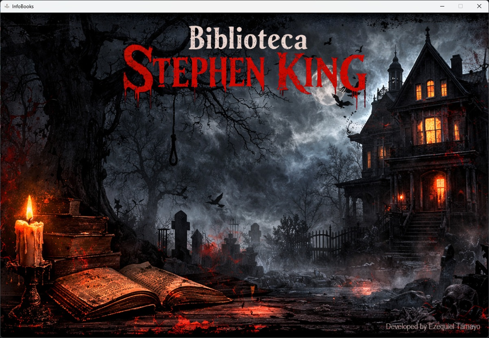
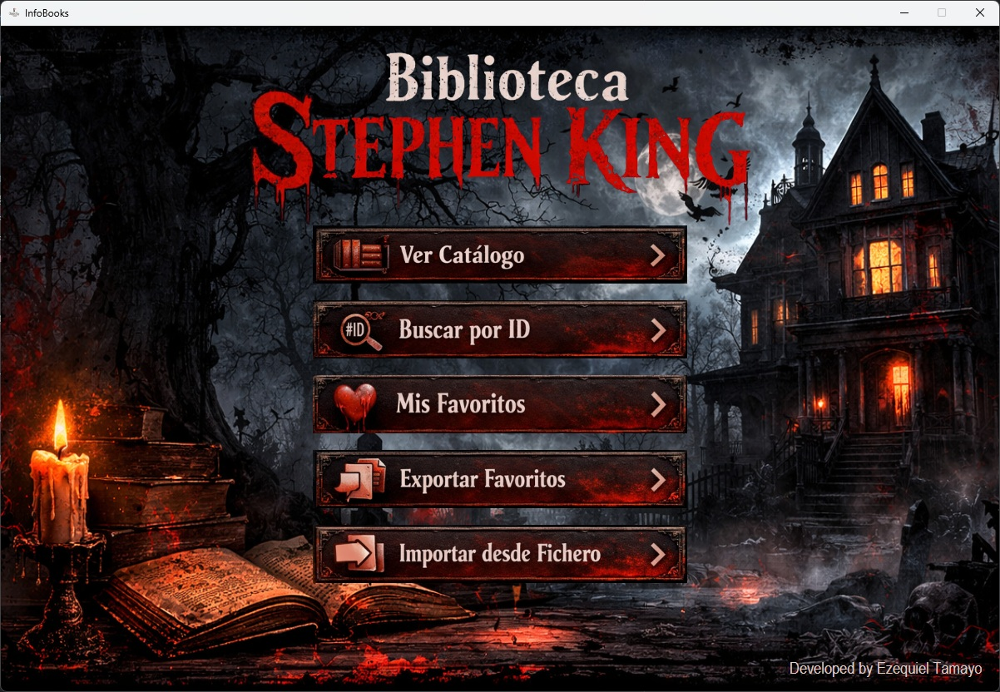
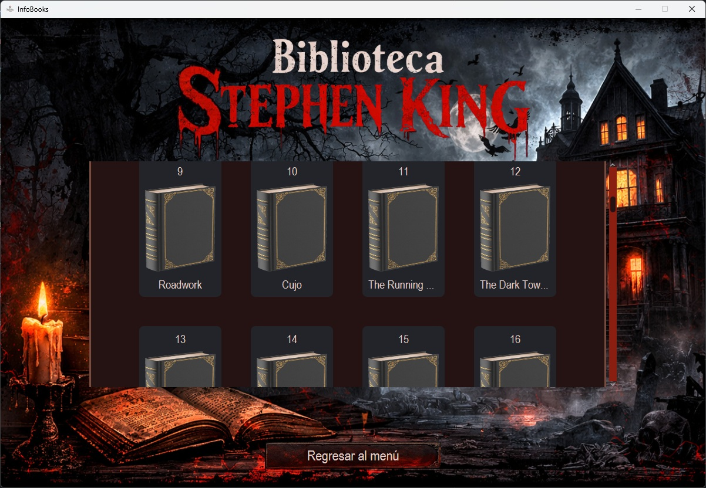
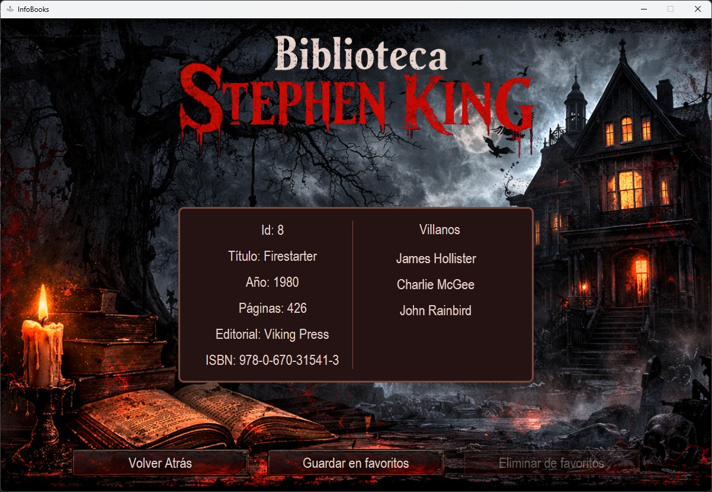
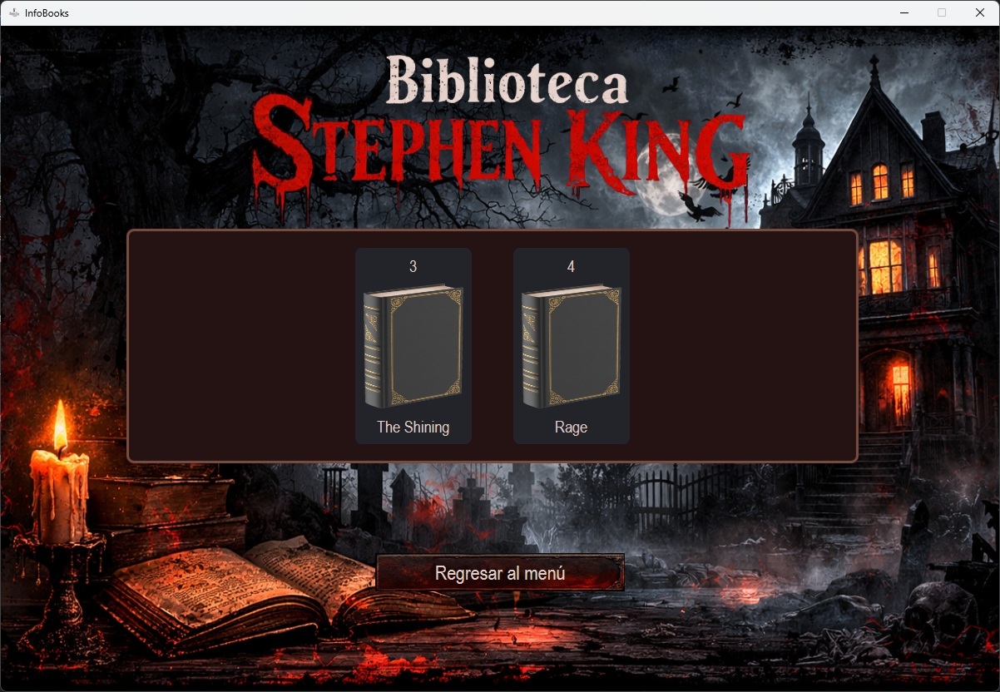
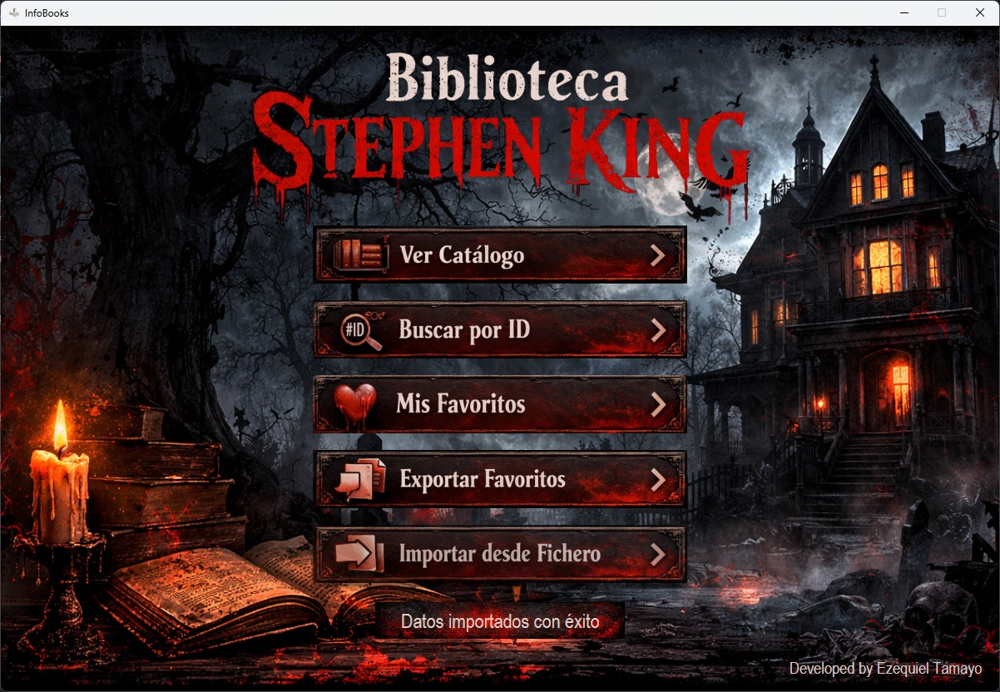

# InfoBooks - Biblioteca de Stephen King

Aplicación de escritorio en Java (JavaFX) que consume la **Stephen King API** para explorar el catálogo de libros del autor, guardar favoritos y consultar el detalle de cada obra, incluyendo sus villanos asociados.

---

## Capturas de la Aplicación








---

## Funcionalidades

- **Consulta de catálogo:** obtiene el listado completo de libros desde la API pública [Stephen King API](https://stephen-king-api.onrender.com/), incluyendo título, año, editorial, ISBN y número de páginas.
- **Detalle de libro:** consulta de un libro individual por ID, con su lista de villanos asociados (si los tiene).
- **Gestión de favoritos:** añadir o eliminar libros de una lista de favoritos personal, con validaciones para evitar duplicados o eliminar libros no marcados.
- **Búsqueda en biblioteca y favoritos:** localización de un libro por ID tanto en el catálogo general como en la lista de favoritos.

---

## Tecnologías y Arquitectura

- **Java + JavaFX:** Interfaz gráfica de escritorio.
- **HttpClient (Java nativo):** peticiones GET a la API REST externa sin librerías adicionales de terceros para el consumo HTTP.
- **org.json:** parseo manual de las respuestas JSON (`JSONObject`, `JSONArray`) para mapear los datos a los modelos de dominio.
- **Lombok:** generación de getters/setters (`@Getter`, `@Setter`) para reducir el código repetitivo en los modelos.
- **Patrón Singleton:** `AppController` centraliza el estado global de la aplicación (libro actual seleccionado, controlador de biblioteca).
- **Serialización:** los modelos `Book` y `Villain` implementan `Serializable` para permitir persistencia local de los datos descargados.

---

## Modelo de Datos

- **`Book`:** id, año, título, editorial, ISBN, número de páginas y lista de `Villain` asociados.
- **`Villain`:** nombre del antagonista relacionado con el libro.
- **`Library`:** contiene dos listas independientes: `libraryBooks` (catálogo general) y `favouriteBooks` (selección del usuario).

---

## Estructura del Proyecto

```text
src/main/java/org/zeki/infobooks/
├── model/                  # Book, Villain, Library
├── controller/app/
│   ├── AppController.java      # Singleton con el estado global
│   ├── ApiController.java      # Peticiones HTTP a la Stephen King API
│   └── LibraryController.java  # Lógica de favoritos y búsqueda
└── util/                   # TransitionHelper y utilidades varias
```

---

## Cómo ejecutar el proyecto

```bash
git clone https://github.com/TamezeDev/info-books.git
```

Ábrelo con un IDE compatible con JavaFX (IntelliJ IDEA recomendado) y ejecuta la clase principal. Requiere conexión a internet para consultar la API en tiempo real.
